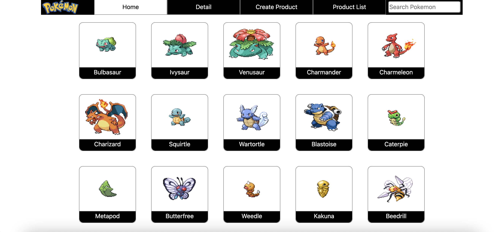
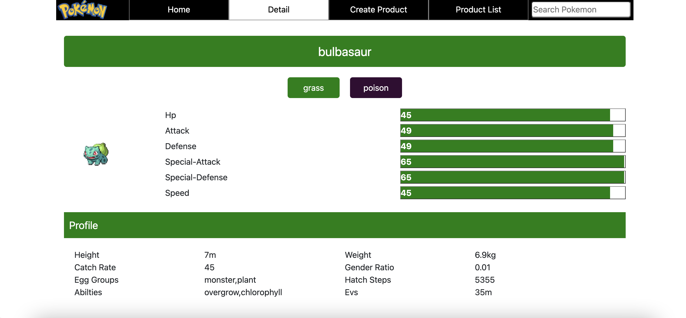
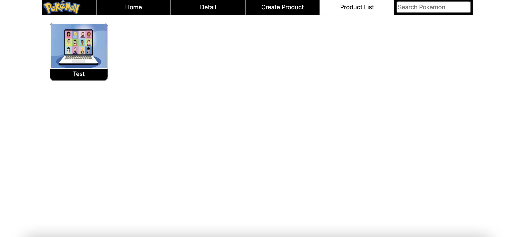
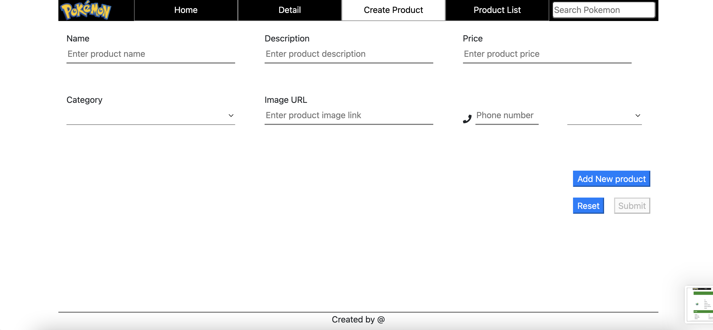

## Development server

Run `npm dev-start` for a dev server. Navigate to `http://localhost:4200/`. The app will automatically reload if you change any of the source files.

## Application Overview 

This application is to show pokemon and its complete details. We can search among the pokemons using search functionality. We can also create new product and list them also.

All the routes are guarded and this application has roles based functionality also. Only
admin can create and see the product.

In user-service-service under service folder has isAdmin property. If it is true then
create product and product list will be visible else hidden from view.

Pokemon Feed Screen

Pokemon Detail Screen

Product Info Screen

Create Product Screen

# Tech Stack 

This project was generated with [Angular CLI](https://github.com/angular/angular-cli) version 9.1.5.

# Development
Angular 9.1.5
Bootsrap 4.1.3
RxJs 6.1

# End to End Testing
Karma + Protractor

# Unit Test
Jest Framwework.

# Deployment on serve
Express
Node Js library to serve application over internet.

# Local setup
1. npm install - to install all dependecies
2. npm run dev-start - to run locally 
`http://localhost:4200/`

